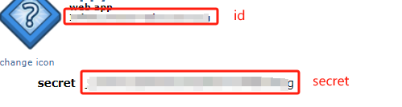

### 1. create a reddit app

go to https://www.reddit.com/prefs/apps/ and register a new app for Reddit using the following parameters.

| Parameter        | Value                      |
|------------------|:---------------------------|
| Type       | `web app`                  |
| redirect uri | your redirect uri          |
| description      | Your own description       |
| about Url        | Url to your own about page |

save client id and secret for future use.



### 2. update manifest

update link unfurling domain to 
```json
  "domains": [
     "www.reddit.com",
      "reddit.com"
  ],
```

### 3. install package

npm install adaptivecards-templating

npm install axios

### 4. update env variables

- add reddit id and secret into .env.local and .env.local.user file:
  ```
  REDDIT_ID=<your reddit id>
  ```
  ```
  SECRET_REDDIT_PASSWORD=<your reddit secret>
  ```


### 5. update code
Add following code:
- src/redditApi/RedditAppAuthenticator.ts: the class to get Reddit api token
- src/redditApi/RedditHttpClient.ts: the class to call Reddit api 
- srcredditApi/RedditLinkModel.ts: define reddit link model
- srcredditApi/RedditOptions.ts: define reddit id and password

Update following code:
- src/linkUnfurlingApp.ts:
```ts
import * as ACData from "adaptivecards-templating";
  public async handleTeamsAppBasedLinkQuery(
    context: TurnContext,
    query: AppBasedLinkQuery
  ): Promise<MessagingExtensionResponse> {
    // When the returned card is an adaptive card, the previewCard property of the attachment is required.
    const post = await this.redditClient.GetLink(query.url);
    const template = new ACData.Template(helloWorldCard);
    const adaptiveCard = template.expand({
      $root: {
        post: post,
      }
    });

    const previewCard = CardFactory.heroCard(post.title, post.subreddit, [post.thumbnail]);

    const attachment = { ...CardFactory.adaptiveCard(adaptiveCard), preview: previewCard };

    return {
      composeExtension: {
        type: "result",
        attachmentLayout: "list",
        attachments: [attachment],
        suggestedActions: {
          actions: [
            {
              title: "default",
              type: "setCachePolicy",
              value: '{"type":"no-cache"}',
            },
          ],
        },
      },
    };
  }
  ```


### 6. local debug

hit F5 to start local debug, past a reddit link into chatbox and see the unfurled card